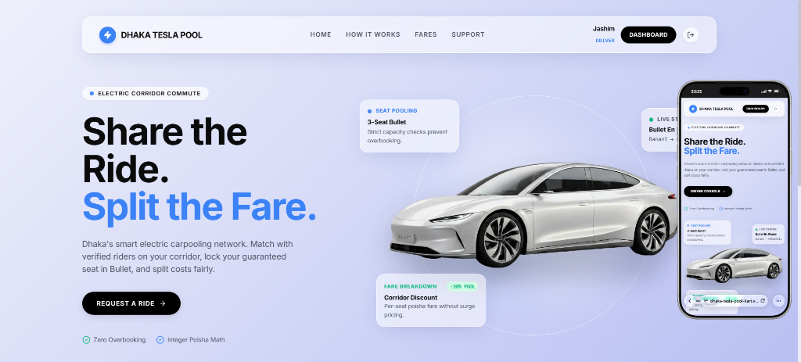

# Dhaka Tesla Pool — Smart Shared Commuter MVP

[](file:///g:/New%20Projects/Dhaka%20Tesla%20Pool/backend/src/phase8.test.ts)
[](file:///g:/New%20Projects/Dhaka%20Tesla%20Pool/frontend)
[](file:///g:/New%20Projects/Dhaka%20Tesla%20Pool/backend)
[](file:///g:/New%20Projects/Dhaka%20Tesla%20Pool/docker-compose.yml)
[](LICENSE)



> **Dhaka Tesla Pool** is a production-grade ride-pooling MVP tailored for Dhaka commuters. In this assessment scenario, "Tesla" is the local affectionate nickname for **Bullet** — a modern 3-passenger battery-powered electric vehicle operated by driver **Jashim**. Passengers with nearby pickups and overlapping corridor destinations share Bullet, while the system strictly guarantees that vehicle capacity is never exceeded, fares are split fairly in integer poisha, and state transitions remain deterministic.

---

## 📋 Table of Contents
1. [Core Features & Problem Statement](#-core-features--problem-statement)
2. [Story Cast & Demo Credentials](#-story-cast--demo-credentials)
3. [System Architecture & Data Flow](#-system-architecture--data-flow)
4. [Database Design & ERD](#-database-design--erd)
5. [Technology Stack & Justifications](#-technology-stack--justifications)
6. [Repository Structure](#-repository-structure)
7. [Local Setup & Running with Docker](#-local-setup--running-with-docker)
8. [Automated Test Suite (75/75 Passing)](#-automated-test-suite-7575-passing)
9. [API Specification](#-api-specification)
10. [Key Decisions, Trade-Offs & Concurrency Handling](#-key-decisions-trade-offs--concurrency-handling)
11. [1-Million Passenger Scaling Strategy (Bonus)](#-1-million-passenger-scaling-strategy-bonus)
12. [AI Usage Disclosure](#-ai-usage-disclosure)
13. [6-Minute Demo Video Walkthrough Guide](#-6-minute-demo-video-walkthrough-guide)

---

## ⚡ Core Features & Problem Statement

In chaotic urban transit corridors like **Banani ➔ Mohakhali / Gulshan**, shared mobility suffers from:
1. **Overbooking & Capacity Chaos:** Multiple riders claiming the last seat at the same second.
2. **Unfair Pricing:** Flat rates or arbitrary pricing rather than distance-proportional split fares.
3. **Invalid State Transitions:** Driver marking arrivals or starts out-of-order, or passengers cancelling mid-transit.
4. **Privacy Leaks:** Exposing personal dropoff locations and individual fares to other co-riders.

### How Dhaka Tesla Pool Solves This:
* **Atomic Capacity Enforcement:** Database-level transactional conditional updates prevent capacity ($\le 3$ seats) from ever being exceeded.
* **Deterministic State Machine:** Central status transition validator enforcing `REQUESTED → MATCHED → ACCEPTED → DRIVER_ARRIVED → STARTED → COMPLETED` (plus guarded `CANCELLED`).
* **Integer Poisha Arithmetic:** All financial math uses integer poisha (1 BDT = 100 poisha) with whole-number rounding to eliminate floating-point drift.
* **Corridor Route Compatibility:** Matches overlapping trips (e.g. Banani ➔ Mohakhali & Banani ➔ Gulshan 1) automatically applying a 20% pooling discount.
* **Zero Privacy Leakage:** Co-riders only see occupant counts and seat manifest badges; personal phone numbers, dropoff zones, and individual fares remain strictly confidential.

---

## 🎭 Story Cast & Demo Credentials

Pre-seeded assessment personas ready for 1-click testing:

| Persona | Role | Scenario Description | Default Login |
|---|---|---|---|
| **Jashim** | Driver | Operates **Bullet** (DHK-TESLA-001, 3 seats). Accepts pools, marks arrivals, starts and completes trips. | `jashim@example.com` / `password123` |
| **Nusrat** | Passenger | Primary commuter requesting Banani ➔ Mohakhali (1 seat, ৳62). | `nusrat@example.com` / `password123` |
| **Rafiq** | Passenger | Corridor co-rider requesting Banani ➔ Gulshan 1 (1 seat, ৳72). | `rafiq@example.com` / `password123` |
| **Shirin** | Passenger | High-contention contestant who tries to book the 3rd seat simultaneously with another rider to verify concurrency protection. | `shirin@example.com` / `password123` |

---

## 🏗️ System Architecture & Data Flow

```
Passenger / Driver Web Browser
               │
               ▼
  Next.js 14 App Router + TypeScript (Port 3000)
  ├── Glassmorphic UI (Tailwind CSS + Framer Motion)
  ├── Live Fleet Telemetry & Interactive Corridor Calculator
  └── Auth Context + State Synchronizers
               │
               ▼ HTTPS / REST (JWT Bearer Token)
  Express REST API (Node.js + TypeScript, Port 4000)
  ├── Auth & RBAC Middleware (Ownership & Role Verification)
  ├── Fare Service (Integer Poisha Engine)
  ├── Pool Service (Atomic Concurrency & Capacity Lock)
  ├── Central Transition Validator (State Machine)
  └── Audit Log Writer
               │
               ▼ Prisma ORM / SQL Transactions
  PostgreSQL 16 Relational Database (Port 5432)
```

---

## 🗄️ Database Design & ERD

```
┌──────────────┐          ┌────────────────┐
│    users     │1       N │    vehicles    │
│──────────────│──────────│────────────────│
│ id (PK)      │          │ id (PK)        │
│ name         │          │ driver_id (FK) │
│ email (UQ)   │          │ capacity (=3)  │
│ password_hash│          │ is_online      │
│ role         │          └───────┬────────┘
└──────┬───────┘                  │ 1
       │ 1                        │
       │                          │ N
       │ N                        ▼
┌──────▼───────┐          ┌────────────────┐
│ride_requests │1        N│     pools      │
│──────────────│──────────│────────────────│
│ id (PK)      │          │ id (PK)        │
│ passenger_id │          │ vehicle_id (FK)│
│ pickup_zone  │          │ driver_id (FK) │
│ dest_zone    │          │ occupied_seats │
│ seat_count   │          │ status         │
│ fare_poisha  │          └───────┬────────┘
│ status       │                  │ 1
└──────┬───────┘                  │
       │ 1                        │ N
       │ N                        ▼
┌──────▼───────┐          ┌────────────────┐
│status_history│          │pool_memberships│
│──────────────│          │────────────────│
│ id (PK)      │          │ id (PK)        │
│ ride_req_id  │          │ pool_id (FK)   │
│ from_status  │          │ ride_req_id(FK)│
│ to_status    │          │ seats_reserved │
│ changed_by   │          │ fare_poisha    │
└──────────────┘          └────────────────┘
```

---

## 🛠️ Technology Stack & Justifications

| Layer | Selected Technology | Why Chosen for Dhaka Tesla Pool | When to Switch in the Future |
|---|---|---|---|
| **Frontend** | Next.js 14 App Router + TypeScript | Built-in routing, layout hydration, server/client boundary segregation, clean component architecture. | If building native mobile apps, migrate UI primitives to React Native. |
| **Styling** | Tailwind CSS + Framer Motion | Rapid custom styling, zero runtime CSS bloat, and smooth physical micro-animations for seat visualizers and steppers. | If corporate UI requires a locked design library (e.g. Mantine or MUI). |
| **Backend** | Node.js + Express + TypeScript | Lightweight, fast async I/O, straightforward middleware chaining, low abstraction overhead for transparent assessment evaluation. | Switch to NestJS if enterprise team scales to 20+ backend developers needing rigid DI modules. |
| **Database** | PostgreSQL 16 | ACID compliance, row-level locking (`FOR UPDATE`), atomic conditional updates, strict foreign keys, and reliable indexes. | Add PostGIS extension if shifting from corridor zones to arbitrary polygon routing. |
| **ORM** | Prisma | Strict TypeScript type generation, reproducible declarative migrations, and safe parameterized query execution. | Switch to Drizzle or raw Kysely if sub-millisecond query optimization under extreme high-frequency writes is needed. |
| **Validation** | Zod | Runtime schema validation matching compile-time TypeScript types, eliminating malformed payload injection. | Keep Zod; standard across TypeScript ecosystem. |
| **Auth** | JWT + bcrypt | Stateless authentication suitable for decoupled container architecture; secure salted password hashing. | Introduce Redis-backed session revocation if building instant device-kicking admin controls. |

---

## 📁 Repository Structure

```
dhaka-tesla-pool/
├── frontend/                     # Next.js App Router Client
│   ├── app/                      # Routes: /, /auth/login, /auth/register, /passenger, /driver, /driver/payment-history
│   ├── components/motion/        # Tactile visualizers: SeatCapacity, StatusStepper, FareBreakdown, Skeletons
│   ├── context/                  # AuthContext and token state
│   ├── lib/api.ts                # Strongly typed REST client
│   └── Dockerfile
├── backend/                      # Express REST API Server
│   ├── prisma/                   # Schema, migrations & seed script
│   ├── src/
│   │   ├── modules/              # auth, users, vehicles, rides, pools, fares, payments
│   │   ├── middleware/           # authGuard, roleGuard, errorHandler
│   │   ├── shared/utils/         # State machine transitions
│   │   ├── phase8.test.ts        # Comprehensive 6-area assessment test suite
│   │   ├── app.ts & server.ts    # Express initialization
│   └── Dockerfile
├── docker-compose.yml            # Full-stack container orchestration
├── Architecture.md               # Detailed architectural specs
├── Design.md                     # UI/UX design tokens and motion guidelines
├── PRD.md                        # Full product requirements document
└── README.md                     # Project manual
```

---

## 🚀 Local Setup & Running with Docker

### Option A: 1-Command Docker Compose (Recommended)
Make sure Docker Desktop is running, then run in repository root:
```bash
docker compose up --build
```
* **Frontend:** `http://localhost:3000`
* **Backend:** `http://localhost:4000`
* **Health Check:** `http://localhost:4000/health`
* **Database:** `localhost:5432`

---

### Option B: Local Development Setup

#### 1. Backend Setup:
```bash
cd backend
npm install
cp .env.example .env
# Ensure PostgreSQL is running locally, then:
npx prisma migrate dev --name init
npx prisma db seed
npm run dev
```

#### 2. Frontend Setup:
```bash
cd frontend
npm install
cp .env.example .env.local
npm run dev
```

---

## 🧪 Automated Test Suite (75/75 Passing)

Execute the full Vitest suite in `backend/`:
```bash
cd backend
npm test
```

### Verified Business & Risk Domains:
1. **Fare Calculation:** Exact integer poisha arithmetic and 20% discount verification for Nusrat (৳62) and Rafiq (৳72).
2. **State Machine Validity:** Rejection of invalid status skips (e.g. `REQUESTED → COMPLETED`).
3. **Capacity Enforcement:** Database transaction constraint guaranteeing capacity never exceeds 3 seats.
4. **Ownership & Authorization:** Enforcing that Nusrat cannot cancel Rafiq's ride, and drivers cannot mutate unassigned pools.
5. **Cancellation Locking:** Locking cancellation once trip status is `STARTED` and ensuring atomic seat rollbacks.
6. **Concurrency Race Condition:** Simulating two passengers (Nusrat & Shirin) booking the last remaining seat at the exact same millisecond; verifying that 1 succeeds (200/201) and the other fails safely with `409 Conflict`.

---

## 🔌 API Specification

### Authentication
* `POST /api/auth/register` — Create passenger or driver account
* `POST /api/auth/login` — Authenticate and receive JWT
* `GET /api/auth/me` — Retrieve active profile

### Passenger Rides & Fares
* `GET /api/fares/zones` — Public list of predefined Dhaka zones
* `POST /api/fares/estimate` — Calculate transparent corridor fare breakdown
* `POST /api/ride-requests` — Submit a shared ride booking request
* `GET /api/ride-requests/me` — Active ride and past history
* `POST /api/ride-requests/:id/cancel` — Cancel pending/matched ride with atomic seat rollback
* `GET /api/ride-requests/:id/history` — Chronological audit trail of state transitions

### Driver Telemetry & Pool Lifecycle
* `GET /api/driver/vehicle` — Bullet vehicle status & battery telemetry
* `PATCH /api/driver/availability` — Toggle driver online/offline shift
* `GET /api/driver/pools` — Active pool and assigned passenger manifest
* `GET /api/driver/payment-history` — Completed pool revenue and passenger payment records
* `POST /api/pools/:id/accept` — Accept assigned pool
* `POST /api/pools/:id/arrive` — Mark arrival at pickup zone
* `POST /api/pools/:id/start` — Start trip (locks passenger cancellation)
* `POST /api/pools/:id/complete` — Finalize trip and settle fares

---

## 🔒 Key Decisions, Trade-Offs & Concurrency Handling

### 1. The Concurrency Problem (The Shirin Scenario)
* **Problem:** Bullet has 3 seats. 2 are occupied. Nusrat and Shirin both read `availableSeats = 1` and click book simultaneously.
* **Solution:** Atomic conditional update in a single transaction:
  ```ts
  const updateResult = await tx.pool.updateMany({
    where: {
      id: poolId,
      status: PoolStatus.MATCHING,
      occupiedSeats: { lte: pool.totalCapacity - requestedSeats }
    },
    data: { occupiedSeats: { increment: requestedSeats } }
  });
  if (updateResult.count === 0) {
    throw new AppError("The remaining seats were just booked", 409, "POOL_CAPACITY_EXCEEDED");
  }
  ```
  If another transaction increments the seat count first, `updateResult.count` is `0`, triggering an atomic rollback and returning `409 Conflict` without data corruption.

### 2. Trade-Off: Predefined Corridors vs Live GPS Routing
* **Decision:** We use predefined corridor zone pairs (e.g. Banani, Mohakhali, Gulshan 1) rather than live third-party GPS APIs (Google Maps).
* **Rationale:** Eliminates external billing dependencies, network failure points during evaluation, and non-deterministic routing. The algorithm focuses purely on capacity correctness and split-fare calculations.

---

## 📈 1-Million Passenger Scaling Strategy (Bonus)

To scale Dhaka Tesla Pool from MVP to 1,000,000 passengers and 100,000 drivers:
1. **Database Contention & Partitioning:** Partition `pools` and `ride_requests` by geographical zone codes (e.g. `DHAKA_NORTH`, `DHAKA_SOUTH`).
2. **Read Replicas:** Route read queries (`/history`, `/payment-history`, `/zones`) to PostgreSQL read replicas, reserving the primary master for transactional writes.
3. **Stateless API Clustering:** Run multiple backend container replicas behind an NGINX / Cloudflare load balancer.
4. **Idempotency Keys:** Require `X-Idempotency-Key` headers on ride requests to eliminate duplicate billing on spotty mobile network retries.
5. **Real-Time Push:** Transition polling to WebSockets or Server-Sent Events (SSE) for driver-passenger arrival updates.

---

## 🤖 AI Usage Disclosure

In compliance with PRD §23:
* **Tools Used:** Antigravity AI, Claude 3.5 Sonnet, GitHub Copilot, Gemini 3 Pro.
* **Usage Scope:** Generating initial boilerplate schema migrations, designing Tailwind glassmorphism color palettes, and writing comprehensive Vitest boundary tests.
* **Accepted Suggestion:** Using atomic conditional `updateMany` filtering by `occupiedSeats <= totalCapacity - seatCount` inside a database transaction to solve the Shirin race condition without requiring heavy external distributed lock infrastructure.
* **Rejected Suggestion:** AI initially proposed adding Apache Kafka and Redis Pub/Sub for event streaming. This was **rejected** as unnecessary architectural bloat for an MVP, adhering strictly to PRD §18 ("Do not add microservices, Kafka, Kubernetes, or Redis just to look impressive").

---

## 🎥 6-Minute Demo Video Walkthrough Guide

When recording the final submission video, follow this exact timeline:
* **`0:00 – 1:00` (Problem & Mission):** Introduce Dhaka Tesla Pool, the concept of Bullet (3-seat electric vehicle), and the necessity of database-level capacity enforcement and split-fare pooling in Dhaka.
* **`1:00 – 2:30` (Engineering & Architecture):** Show `Architecture.md`, the ERD relationships, the central state machine validator, and explain the atomic concurrency update that prevents overbooking.
* **`2:30 – 4:30` (Product Demo):**
  * Login as **Nusrat** &rarr; Request Banani ➔ Mohakhali (৳62).
  * Login as **Rafiq** in an incognito window &rarr; Request Banani ➔ Gulshan 1 (৳72) &rarr; show automated pooling into Bullet!
  * Login as **Jashim (Driver)** &rarr; View assigned pool manifest, mark Arrived, Start Trip, and Complete Trip.
  * Show Jashim's **Payment History** with live earnings telemetry.
* **`4:30 – 5:30` (The Concurrency Edge Case):** Run `npm test` in the terminal to demonstrate all 75 tests passing, highlighting the Shirin race condition test.
* **`5:30 – 6:00` (Conclusion & Wrap-Up):** Show clean Docker Compose orchestration and summarize key engineering decisions.
